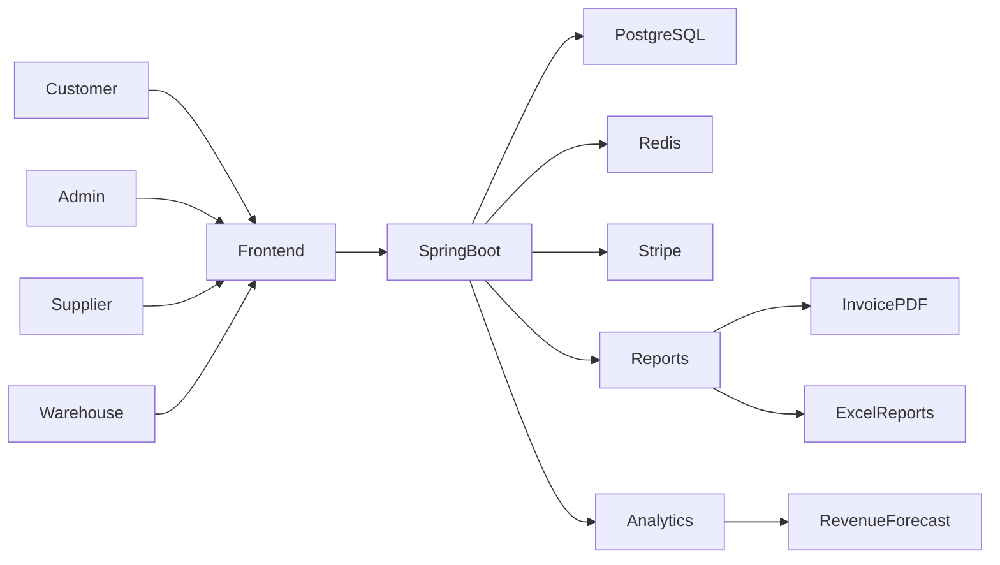
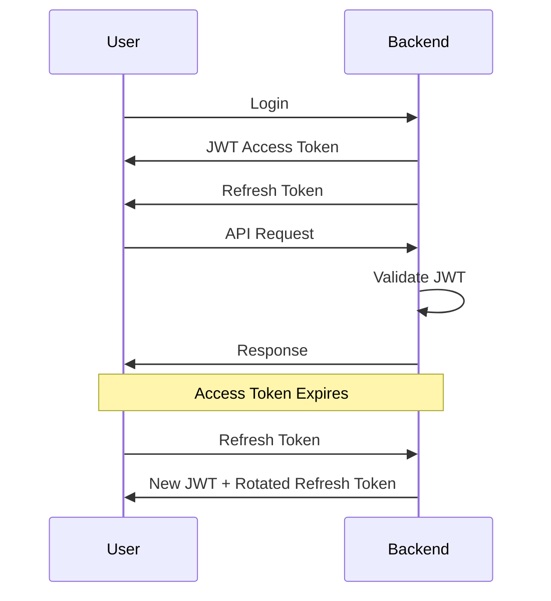

# RB Cart - Enterprise E-Commerce Supply Chain Platform

> Enterprise-grade E-Commerce & Supply Chain Management Platform built to demonstrate production-level Software Development Engineering practices, scalable architecture, and modern full-stack development.

---

## Executive Summary

**RB Cart** is a production-inspired Enterprise E-Commerce Supply Chain Platform designed to simulate the architecture and workflows of large-scale retail ecosystems such as **Amazon**, **Walmart**, and **Flipkart**.

Unlike traditional CRUD-based e-commerce projects, RB Cart focuses on demonstrating software engineering principles expected from modern **Software Development Engineers (SDEs)**.

The platform supports multiple organizational roles including:

- Customer
- Admin
- Warehouse Manager
- Supplier

Every module has been designed around scalability, maintainability, clean architecture, security, and performance optimization.

The project demonstrates enterprise backend engineering with Spring Boot, scalable frontend architecture using React, distributed caching using Redis, secure JWT authentication, payment processing, analytics, reporting, and Docker-based deployment.

---

# Why This Project?

Most portfolio projects stop at:

- Login
- Cart
- Checkout

RB Cart goes significantly further by implementing enterprise engineering concepts that recruiters expect from backend and full-stack software engineers.

Key engineering areas include:

- Secure Authentication Architecture
- Role-Based Access Control (RBAC)
- Redis Distributed Caching
- Payment Gateway Integration
- Dynamic Search Specifications
- Production Logging
- Aspect-Oriented Programming (AOP)
- Revenue Forecasting
- Supply Chain Workflow
- Dockerized Infrastructure
- Modern React Architecture

---

# System Architecture



---

# Technology Stack

## Backend

| Technology | Purpose |
|------------|---------|
| Java 21 (JDK 21) | Core Language |
| Spring Boot 3.3 | Backend Framework |
| Spring Security | Authentication & Authorization |
| Spring Data JPA | ORM Layer |
| Hibernate | Database Mapping |
| PostgreSQL | Production Database |
| H2 Database | Local Development |
| Redis | Distributed Cache |
| Stripe Sandbox | Payment Gateway |
| Spring AOP | Audit Logging |
| Apache POI | Excel Report Generation |
| OpenPDF | Invoice Generation |
| ZXing | Barcode / QR Code Generation |
| HikariCP | Database Connection Pool |

---

## Frontend

| Technology | Purpose |
|------------|---------|
| React (Vite) | Frontend Framework |
| TypeScript | Type Safety |
| Tailwind CSS v4 | Styling |
| React Router v6 | Client Routing |
| Axios | API Communication |
| Recharts | Dashboard Analytics |

---

## DevOps

| Technology | Purpose |
|------------|---------|
| Docker | Containerization |
| Docker Compose | Multi-service Orchestration |

---

# Enterprise Software Architecture

```
Presentation Layer
        │
        ▼
REST Controllers
        │
        ▼
Service Layer
(Business Logic)
        │
        ▼
Repository Layer
(Spring Data JPA)
        │
        ▼
Database
(PostgreSQL / H2)
```

Cross-cutting concerns:

- Spring Security
- JWT
- Redis Cache
- AOP Logging
- Validation
- Exception Handling

---

# Authentication Architecture

RB Cart implements an enterprise authentication system using **JWT Access Tokens** and **Refresh Token Rotation**.

Features include:

- Stateless authentication
- Refresh token lifecycle management
- Secure HTTP-only cookies
- Token expiration
- Automatic token refresh
- Session invalidation
- Password encryption using BCrypt
- Spring Security filter chain
- Fine-grained endpoint authorization

Authentication Flow



---

# Role-Based Access Control (RBAC)

RB Cart supports multiple enterprise user roles.

| Role | Permissions |
|------|-------------|
| Customer | Browse, Cart, Checkout, Orders |
| Supplier | Product Supply, Inventory Updates |
| Warehouse Manager | Stock Management, Shipment Workflow |
| Admin | Complete Platform Administration |

Every API endpoint is secured using Spring Security authorization rules.

---

# Database Engineering

The persistence layer is designed for scalability.

## Features

- Spring Data JPA
- Hibernate ORM
- Entity Relationships
- Pagination
- Lazy Loading
- Transaction Management
- Optimized Queries

### Dynamic Search Specifications

Instead of writing dozens of SQL queries, RB Cart uses **Spring Specifications**.

Users can filter products using:

- Category
- Brand
- Price Range
- Product Name
- Availability
- Keyword Search

This allows dynamic query generation while keeping repositories clean and maintainable.

---

# Database Connection Optimization

RB Cart uses **HikariCP**, one of the fastest JDBC connection pools.

Benefits include:

- Reduced connection latency
- Efficient resource utilization
- Connection reuse
- High throughput
- Better scalability under concurrent traffic

---

# Redis Distributed Caching

Redis is used as an in-memory cache layer to reduce database load.

## Trending Products

Trending products are maintained using **Redis Sorted Sets**.

Advantages:

- O(log n) ranking
- Real-time popularity updates
- Fast leaderboard generation
- Reduced database reads

## Frequently Viewed Products

Redis stores recently viewed products to improve:

- Homepage recommendations
- Personalized browsing
- Product suggestions

---

# Payment Processing

RB Cart integrates **Stripe Sandbox** for secure payment simulation.

Features include:

- Credit Card Checkout
- Payment Intent API
- Secure Transaction Flow
- Order Confirmation
- Payment Validation

The implementation follows production-ready payment workflows while remaining safe for development and demonstrations.

---

# Aspect-Oriented Programming (AOP)

Spring AOP is used to capture cross-cutting concerns without polluting business logic.

Automatically logged events include:

- Product creation
- Product updates
- Supplier inventory changes
- Warehouse stock movement
- Order status transitions
- Administrative operations

Benefits:

- Cleaner services
- Centralized auditing
- Timeline generation
- Easier debugging
- Operational transparency

---

# Revenue Analytics

RB Cart includes an analytics module for administrative reporting.

Features:

- Daily Revenue
- Monthly Revenue
- Sales Trends
- Product Performance
- Category Performance

### Forecasting

Historical sales data is processed using **Linear Regression** to estimate future revenue.

The results are visualized using **Recharts**.

```text
Historical Sales
        │
        ▼
Linear Regression
        │
        ▼
Future Revenue Prediction
        │
        ▼
Admin Dashboard Charts
```

---

# Reporting Engine

RB Cart automatically generates business reports.

Supported formats:

- PDF Invoices (OpenPDF)
- Excel Reports (Apache POI)

Reports include:

- Order Invoice
- Sales Report
- Inventory Report
- Revenue Summary

---

# Barcode & QR Code Support

ZXing is used for inventory operations.

Generated assets include:

- Product Barcode
- Inventory QR Codes
- Warehouse Labels
- Shipment Identification

---

# Interactive Features

## Dynamic Theme

- Dark Mode
- Light Mode
- Persistent Theme Preferences

---

## AI Help Chatbot

An integrated AI assistant provides customer support.

Capabilities include:

- Order Tracking
- Coupon Code Status
- Shipping Questions
- Refund Assistance
- Frequently Asked Questions

---

## Natural Language Product Search

Users can search products using conversational language.

Examples:

```
Show laptops under ₹60000

Running shoes for women

Gaming mouse below ₹2500

Best headphones for coding
```

The backend parses natural language queries into structured search filters.

---

# Project Structure

```text
RB-Cart/
│
├── backend/
│   ├── src/
│   │   ├── main/
│   │   │   ├── java/
│   │   │   │   ├── config/
│   │   │   │   ├── controller/
│   │   │   │   ├── dto/
│   │   │   │   ├── exception/
│   │   │   │   ├── model/
│   │   │   │   ├── repository/
│   │   │   │   ├── security/
│   │   │   │   ├── service/
│   │   │   │   └── application/
│   │   │   └── resources/
│   │   │       ├── application.yml
│   │   │       └── static/
│   │   └── test/
│   ├── pom.xml
│   └── mvnw
│
├── frontend/
│   ├── src/
│   │   ├── components/
│   │   ├── context/
│   │   ├── pages/
│   │   ├── services/
│   │   ├── hooks/
│   │   ├── utils/
│   │   ├── types/
│   │   ├── App.tsx
│   │   └── main.tsx
│   ├── package.json
│   └── vite.config.ts
│
├── docker-compose.yml
├── .gitignore
└── README.md
```

---

# Execution Modes

## Mode A — Local Standalone Development

### Backend

The backend automatically uses the embedded **H2 Database** when PostgreSQL is unavailable, enabling rapid local development.

```bash
cd backend

./mvnw spring-boot:run
```

Windows

```powershell
.\mvnw spring-boot:run
```

Backend

```
http://localhost:8080
```

---

### Frontend

```bash
cd frontend

npm install

npm run dev
```

Frontend

```
http://localhost:5173
```

---

## Mode B — Dockerized Production Environment

Run the complete production stack with Docker Compose.

Services include:

- PostgreSQL
- Redis
- Spring Boot Backend
- React Frontend

```bash
docker-compose up --build
```

After startup:

| Service | URL |
|----------|-----|
| Frontend | http://localhost:5173 |
| Backend API | http://localhost:8080 |
| PostgreSQL | localhost:5432 |
| Redis | localhost:6379 |

---

# Scalability Considerations

The project has been designed with production scalability in mind.

Current engineering practices include:

- Layered Architecture
- Dependency Injection
- DTO Pattern
- Repository Pattern
- Centralized Exception Handling
- Stateless Authentication
- Redis Caching
- Database Connection Pooling
- Dockerized Deployment
- Modular React Components

Potential future enhancements:

- Microservices
- Kafka Event Streaming
- Elasticsearch
- Kubernetes
- CI/CD Pipelines
- API Gateway
- Distributed Tracing
- Prometheus & Grafana Monitoring

---

# Engineering Principles

RB Cart follows widely accepted software engineering practices.

- SOLID Principles
- Clean Architecture
- Separation of Concerns
- RESTful API Design
- Secure Authentication
- Reusable Components
- Type Safety
- Modular Codebase
- Production-Oriented Deployment

---

# Target Audience

This repository is intended to demonstrate engineering capabilities for:

- Software Development Engineer (SDE)
- Backend Engineer
- Full Stack Engineer
- Platform Engineer
- Software Engineering Internships
- Campus Placements
- Technical Interviews

---

# License

This project is intended for educational, portfolio, and demonstration purposes. Commercial use should comply with the licenses of all third-party dependencies.
