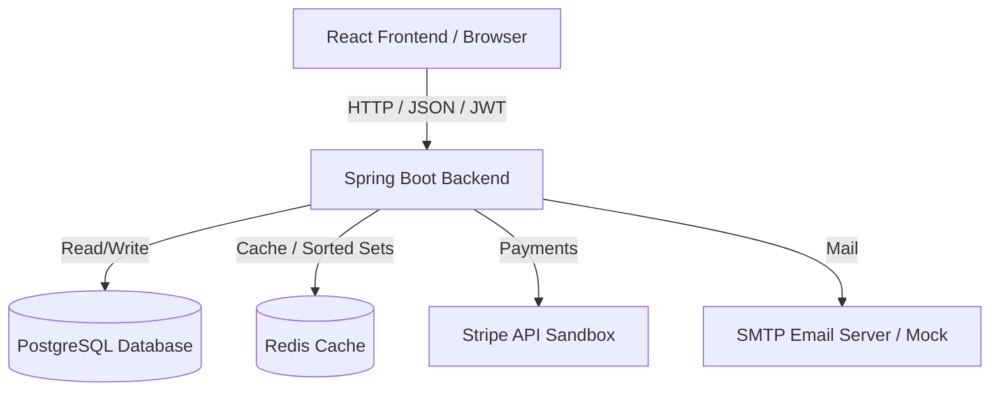
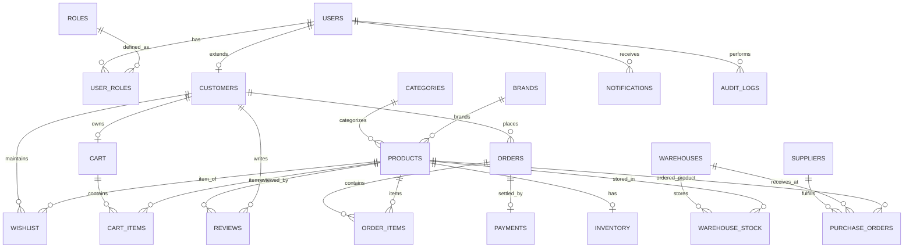

# Implementation Plan: Enterprise E-Commerce Platform

This plan outlines the architecture, database schema, security mechanism, caching strategies, and frontend components to build a production-ready Enterprise E-Commerce System with Inventory, Warehouse, and Order Management.

---

## Technical Architecture

The application will be divided into two main layers:
1. **Backend**: Java Spring Boot 3.3+ (Java 21) using Spring Data JPA, Spring Security, JWT, PostgreSQL, Redis, and Stripe.
2. **Frontend**: React (Vite) with TypeScript, Tailwind CSS, React Router, and Axios.

We will provide a Dockerized environment to spin up PostgreSQL, Redis, the Spring Boot Backend, and the React Frontend using Nginx.

---

## User Review Required

> [!IMPORTANT]
> - **Java Version**: We will use OpenJDK 21 discovered on your system (`C:\Users\Yuvraj\.antigravity-ide\extensions\redhat.java-1.55.0-win32-x64\jre\21.0.11-win32-x86_64\bin\java.exe`) as the execution environment.
> - **Maven Wrapper**: Since Maven is not installed globally, we will download and include the Maven Wrapper (`mvnw` and `mvnw.cmd`) in the backend so it can be built and run using `.\mvnw` directly.
> - **Local Development Fallback**: Since Docker is not installed on your system, we will configure a `dev` profile that allows running the backend with **H2 database** and **in-memory Spring Cache** as fallback if PostgreSQL/Redis are not available, ensuring that you can run and test the project locally without any external dependencies. The default `prod` profile will use PostgreSQL, Redis, and Stripe.
> - **Stripe Sandbox Keys**: You will need to provide Stripe API Sandbox credentials (`STRIPE_SECRET_KEY` and `STRIPE_PUBLISHABLE_KEY`) in the environment variables to test real card processing, although we will provide a robust mock payment processor fallback when credentials are empty.

---

## Open Questions

> [!NOTE]
> 1. Do you want to use **H2 database** automatically during local development if PostgreSQL is not running, or should it fail fast? *(We recommend automatic fallback to H2 so the project runs immediately)*
> 2. For the PDF and Excel exporting, would you prefer using Apache POI (Excel) and OpenPDF (PDF)?
> 3. For Barcode and QR code generation, would you prefer generating them dynamically on the backend (using ZXing library) and sending base64/image URLs to the frontend, or generating them client-side? *(We recommend backend generation to demonstrate robust enterprise utility services)*

---

## Proposed Changes

We will create a multi-module folder structure in `d:\EComm`:
- `backend/`: Spring Boot Java application
- `frontend/`: React TypeScript Tailwind CSS application
- `docker-compose.yml` and supporting Docker configuration files

---

### Component 1: Database Schema Design (ERD)

The database will consist of 21 tables supporting authentication, product catalogs, warehouse stock management, purchases, carts, orders, payments, coupons, reviews, wishlists, and notifications.

---

### Component 2: Backend Architecture & Implementation

#### [NEW] [pom.xml](file:///d:/EComm/backend/pom.xml)
Maven project descriptor. Dependencies include:
- `spring-boot-starter-web` (REST APIs)
- `spring-boot-starter-security` (Security & OAuth/JWT)
- `spring-boot-starter-data-jpa` (Persistence)
- `spring-boot-starter-data-redis` (Caching and user sessions)
- `spring-boot-starter-validation` (Input validation)
- `spring-boot-starter-mail` (Email notifications)
- `postgresql` (PostgreSQL driver)
- `h2` (In-memory fallback database)
- `lombok` (Boilerplate reduction)
- `jjwt-api`, `jjwt-impl`, `jjwt-jackson` (JWT processing)
- `stripe-java` (Stripe payments integration)
- `zxing-core`, `zxing-javase` (Barcode and QR code generation)
- `poi-ooxml` (Excel export)
- `openpdf` (PDF export)
- `springdoc-openapi-starter-webmvc-ui` (Swagger UI / OpenAPI documentation)

#### [NEW] Backend Directory Structure
We will create packages under `com.enterprise.ecommerce`:
1. `config`: Database fallback, Security configuration, CORS setup, Redis caching configuration, and Swagger/OpenAPI setup.
2. `security`: JWT filter, token providers, BCrypt password hashing, Custom UserDetailsService, and Role-Based Access Control (RBAC).
3. `model`: Entities corresponding to the database schema.
4. `dto`: Request and response Transfer Objects (e.g., `RegisterRequest`, `LoginRequest`, `OrderDTO`, `PaymentRequest`, etc.).
5. `repository`: JPA interfaces supporting filtering, custom pagination, and inventory queries.
6. `service`: Business logic for:
   - `AuthService`: Login, register, refresh tokens, forgot/reset password, email verification.
   - `ProductService`: Product search, filtration, caching with Redis, category tracking.
   - `InventoryService`: Current stock, reserved stock, low-stock triggers, adjustment logs.
   - `WarehouseService`: Stock transfer, capacity verification, incoming/outgoing shipments.
   - `SupplierService`: Purchase orders, supplier tracking.
   - `OrderService`: State machine tracking (Pending -> Confirmed -> Packed -> Shipped -> Delivered -> Completed), cart checkout, stock reservation.
   - `PaymentService`: Stripe Session creation, refunds, transaction recording.
   - `CouponService`: Validating and consuming coupons.
   - `ReviewService`: Review creation, approval, and product average rating updates.
   - `NotificationService`: Internal alerts and email delivery.
   - `AnalyticsService`: Revenue aggregation, monthly sales charts, best sellers, forecasting.
   - `ExportService`: Excel/PDF export of orders.
   - `BarcodeService`: ZXing dynamic generation of bar/QR codes.
   - `AuditLogService`: Dynamic aspect-oriented audit logging of admin/manager actions.
7. `controller`: REST Endpoints mapping actions to services.
8. `exception`: Global Exception Handler returning consistent JSON error structures.

---

### Component 3: Frontend Architecture & Layouts

We will build a React Single Page Application in the `frontend` folder using:
- **State Management**: React Context or lightweight hooks for auth, cart, and preferences.
- **Routing**: `react-router-dom` with Private/Protected Route wrappers enforcing Role-Based Access Control (RBAC).
- **Styling**: Tailwind CSS with custom glassmorphism and modern palettes.
- **Charting**: `recharts` for dashboard analytics graphs.

#### Views & Dashboards:
1. **Auth Pages**: Login, Register, Email Verification page, Forgot/Reset Password templates.
2. **Customer Portal**:
   - Home Page: Featuring categories, brands, search bars, filters, and frequently viewed items cached from Redis.
   - Product Details: Product info, dynamically rendered barcodes/QR codes, interactive reviews, and wishlist buttons.
   - Cart & Checkout: Multi-step checkout with Stripe card inputs, coupon code validation, and invoice generation.
   - Customer Profile: Order history with live timeline status (Pending -> Delivered).
3. **Admin Dashboard**:
   - Key KPI Cards: Revenue, Active Users, Total Orders, Stock Value.
   - Analytics Chart: Interactive monthly sales graph and best-selling products list.
   - Inventory Forecast: Visualization of predicted stockouts using moving averages.
   - Review Moderation Portal & User Management.
4. **Warehouse Dashboard**:
   - Warehouse metrics (capacity meters).
   - Stock transfer forms and shipping tracking logs.
5. **Supplier Dashboard**:
   - Purchase order tracking and Supplier profile updates.

---

### Component 4: Docker Configuration

#### [NEW] [Dockerfile](file:///d:/EComm/backend/Dockerfile)
Multi-stage build compiling Java Spring Boot and hosting it via lightweight JRE.

#### [NEW] [Dockerfile](file:///d:/EComm/frontend/Dockerfile)
Multi-stage build compiling React and serving static files via Nginx.

#### [NEW] [docker-compose.yml](file:///d:/EComm/docker-compose.yml)
Orchestrates:
- `db`: PostgreSQL database.
- `cache`: Redis.
- `backend`: Java Spring Boot service (depends on db & cache).
- `frontend`: Nginx serving the React frontend.

---

## Verification Plan

### Automated Tests
- **Unit Tests**:
  - `AuthServiceTest` for registration, token generation, and password recovery.
  - `OrderServiceTest` checking stock reservation, price calculation, coupon application, and state transition validation.
  - `InventoryServiceTest` checking automatic deductions and low stock triggers.
- **Integration Tests**:
  - `ProductControllerIT` validating product searching, sorting, and Redis cache insertion.
  - `CartControllerIT` validating cart additions and checkout procedures.
- **Commands**:
  - Run `.\mvnw test` inside `/backend` to run the complete test suite.
  - Run `npm run test` or check typescript compilation inside `/frontend` with `npm run build`.

### Manual Verification
- Deploying frontend and backend locally.
- Accessing **Swagger UI** (`http://localhost:8080/swagger-ui/index.html`) to test live endpoints.
- Verifying the payment checkout flow using Stripe Sandbox card numbers.
- Navigating the four distinct dashboard layouts (Admin, Warehouse Manager, Supplier, Customer) to confirm dynamic views.
